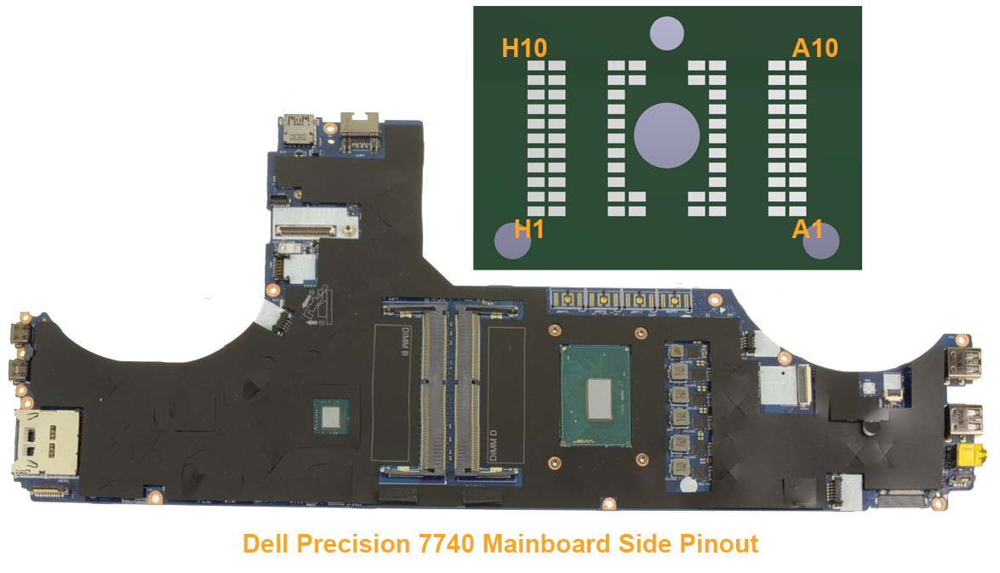
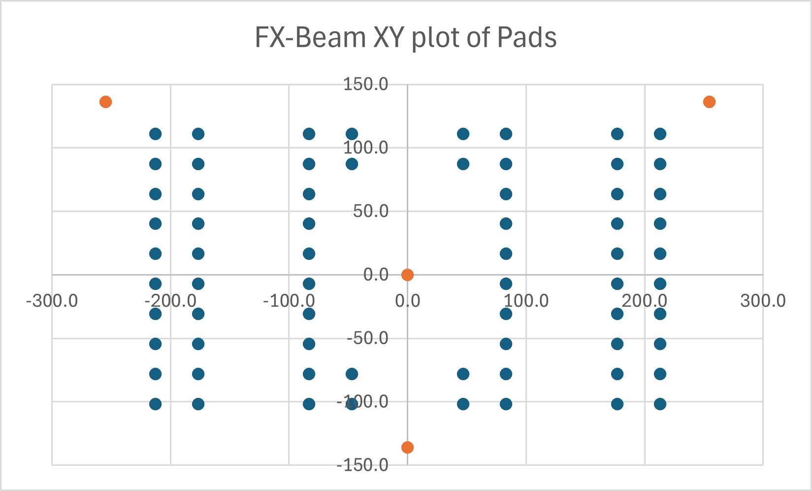
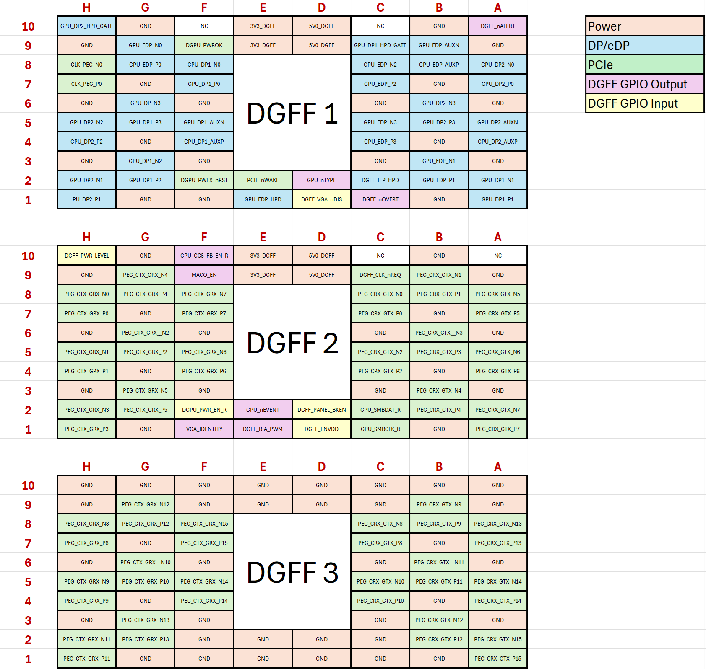

# DGFF GPU Adapter

The goal is simple-- make the Dell DGFF GPU work on PCIe x16 slots. The DGFF GPUs are cheap on eBay, and they're significantly smaller than other GPUs. They could be great for smaller PCs. 

First, if we want to make our own DGFF breakout, we must understand how interface works. Let's first look at the mechanical component, since that's accessible from pictures on Google.

The Dell Precision 7740 is one laptop that pops up a lot as supporting the DGFF modules. Let's take a look at how it's made. There's 4 LGA-style pads right above the CPU. Looking at teardown videos, it seems that the first 3 connectors on the left are for AMD/Nvidia GPUs, and the 4th connector on the right is for Intel graphics (later referred to as UMA in the schematics). It looks awfully similar to the Framework 16's GPU implementation. Let's compare the two.

>  Dell Precision 7740 pinout. Thanks to [jyancat](https://github.com/jyancat/ExpansionBay/tree/main/Electrical/KiCad_templates/Expansion_Bay) for creating a KiCAD file with the footprint of the fx-beam 72P connector. Yes, I know, the KiCAD footprint has 11 rows, just ignore that for now.

The pinout of the Dell footprint seems to differ from the one given by Framework. The [framework design](https://github.com/jyancat/ExpansionBay/blob/main/Electrical/Dual-channel%2074P%20FXBeam%2C%20length%2027.75mm%20_Rev%202_(Public%20version).pdf) has the columns labeled 1-8 (with 1 being on the right side) and the rows labeled A-L (with A being on top). The Dell footprint has the columns labeled A-H (with A being on the right) and the rows being labeled 1-10 (with 1 being on the bottom). In addition, they are electrically incompatible. Framework has 11 pin rows, while dell has 10. Framework is running a PCIe x4 connection over 2 FX-beam connectors while Dell is running a PCIe x16 connection over 3 FX-beam connectors. Framework also rotated the 2nd FX-beam connector relative to the first one, while Dell kept all 4 connectors in the same orientation on the MLB side.

To get the FX-beam connector that Dell uses, we'll have to dive into the motherboard's `.CAD` boardview file. They're somewhere on the Internet if you look hard enough. Once I got one opened, turns out, it's just plain text! So a bit of searching, and under `SHAPE UNIMI_FBGCAX011_68P-T-S` is the footprint data of the FX-beam 68P LGA! It's in a weird format though, so let's import it into excel. Do a little bit of splitting into columns, and some basic math to get the center of the LGA to be 0, and will you look at that! It's the footprint pads!

> FX-Beam 68P pad layout, shown in Excel. The blue is for the power / data pads, and the orange is for the mechanical holes.

